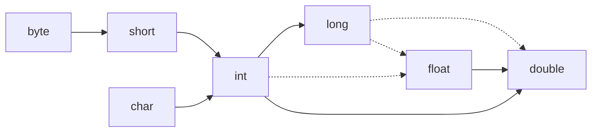

# 基础语法

#### 注释

1. 单行注释 
   
   **//**

2. 多行注释
   
   **/\* \*/**

3. 文档注释
   
   **/\*\* \*/**

#### 数据类型

1. 整型
   
   | 类型    | 存储需求 | 取值范围                                                   |
   |:-----:|:----:|:------------------------------------------------------:|
   | byte  | 1字节  | -128 ~ 127                                             |
   | short | 2字节  | -32768 ~ 32767                                         |
   | int   | 4字节  | -2 147 483 648 ~ 2 147 483 647                         |
   | long  | 8字节  | -9 223 372 036 854 775 808 ~ 9 223 372 036 854 775 807 |

2. 浮点型
   
   | 类型     | 存储需求 | 取值范围                              |
   |:------:|:----:|:---------------------------------:|
   | float  | 4字节  | 大约± 3.402 823 47E+38F             |
   | double | 8字节  | 大约± 1.797 693 134 862 315 70E+308 |

3. char类型

4. boolean（布尔）类型：**false**和**true**

#### 变量与常量

1. 变量用来存储值

2. 常量是值不变的变量

3. 声明变量先指定变量类型，然后是变量名

4. 变量名需以字母开头由字母数字构成的序列

5. 变量名需是有意义的

6. java保留字不能作为变量名

7. 关键字**final**指示常量

8. 常量名使用全大写

9. 使用关键字 **static final** 指示类常量，可以在一个类多个方法使用

#### 枚举

#### 运算符

1. 运算符用于连接值

2. 算术运算符 **+，- ，* ，/ ，%** 表示加，减，乘，除，求余（取模）

3. 参与 **/** 运算的两个操作数都是整数，表示整数除法，否则表示浮点除法 **eg：15.0/2=7.5**

4. 除运算，**eg：15/2=7**

5. 取模，**eg：15%2=1**

6. - 两个操作数，有一个是**double**，另外一个转换为**double**
   
   - 否则，一个操作数是**float**，另一个操作数转换为**float**
   
   - 否则，一个操作数是**long**，另一个操作数转换为**long**
   
   - 否则，两个操作数都转换为**int**

7. 实线表示无精度损失，虚线表示可能有精度损失

8. 强制类型转换

9. 赋值中使用二元运算符，**eg：x+= 4**  等价于 **x= x+ 4**

10. 关系运算符：**== ，!=，>，<，>=，<=，&&，||**

11. 三元运算符

12. 位运算符

13. 括号与运算符级别

#### 字符串

1. 双括号里的字符串是String类的一个实例

2. **substring**方法提取子串

3. 使用 **+** 连接两个字符串

4. String类对象不可变

5. **equals**检测字符串是否相等

6. 空串 **""** 是长度为**0**，内容为**空**的字符串，空串是一个java对象

7. String变量可以存放**null**，表示目前没有对象与变量关联

8. **StringBuilder**类构建字符串

#### 输入输出

#### 控制流程

1. 块（复合语句）是若干条java语句构成的语句，用花括号括起来，确定了变量的作用域

2. 条件语句**if**

3. 循环语句**while，do while，for**

4. 多重选择 **switch**

5. 中断循环控制语句**break，continue**

#### 大数

1. **BigInteger**实现任意精度的整数运算

2. **BigDecimal**实现任意精度的浮点运算

#### 数组

1. 数组是一种数据结构，用来存储同一类型值的集合

2. 通过整型下标（索引）访问数组的值

3. 声明数组指定数组类型（**紧跟[]**）和数组变量名称 **eg：int[] a**

4. 使用new操作符创建数组 **eg：new int[100]**

5. 数组长度不要求是变量：**new int[n]** 创建长度为n的数组

6. 数组一旦创建，长度不可改变

7. 创建数组对象并提供初始值**eg：int[] b = {1, 2, 3}**

8. 声明匿名数组 **eg：new int[] {1, 2, 3}**

9. 数组元素下标从**0**开始

10. 创建数字数组，元素初始化为**0**，boolean数组初始化为**false**，对象数组初始化为**null**

11. 数组变量拷贝到另一个数组变量，将引用同一个数组

12. **Arrays.copyOf()** 拷贝到新数组

13. **Arrays.sort()** 可以对数值型数组排序

14. 多维数组

15. 不规则数组
