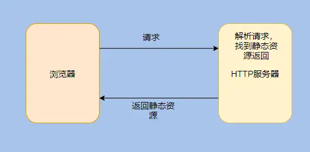
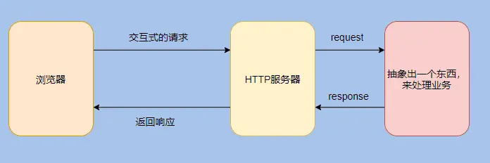
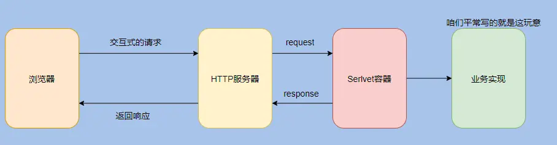
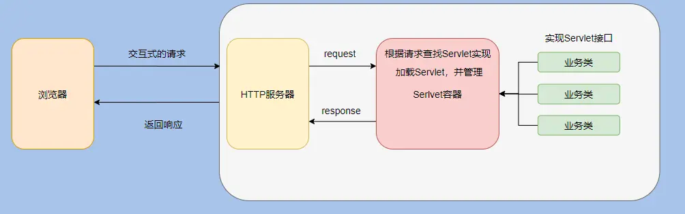

# servlet

浏览器发起 HTTP 请求，早期的时候只会请求一些静态资源，这时候需要一个服务器来处理 HTTP 请求，并且将相应的静态资源返回，这个服务器叫 HTTP 服务器。简单点说就是解析请求，然后得知需要服务器上面哪个文件夹下哪个名字的静态文件，找到返回即可

---

随着互联网的发展，交互越发得重要，单纯的静态文件满足不了需求。业务变得复杂，需要我们编写代码来处理诸多业务。需要根据 HTTP 请求调用不同的业务逻辑来响应。但是我们的业务代码不能跟 HTTP 服务器耦合起来，总不能在 HTTP 服务器的具体实现里面来做判断到底需要调用哪个业务类吧，这就把非业务和业务强相关了，所以需要做一层抽象，将HTTP 的解析和具体的业务隔离

---

本质上的需求就是根据 HTTP 请求找到对应的业务实现类然后执行逻辑再返回。而业务千千万，所以需要规定一个接口，所以业务类都实现这个接口这样才好对接。这就是接口的含义，就像 USB。这个接口就是 Servlet，当然这是最狭义的解释。Servlet 其实是 Server Applet，全称 Java Servlet，指的是用 Java 编写的服务端程序。其实指代的是实现 Servlet 接口的那些业务类。这就是 Servlet 的由来。而 Servlet 容器其实就是用来管理和加载这些 Servlet 类的，根据 HTTP 请求找到对应的 Servlet 类这就是 Servlet 容器要做的事情。看到这是不是觉得还能再抽一层？因为这好像也和具体的业务实现没关系？是的，还能抽一层。没必要把 Servlet 容器做的事情和具体的业务耦合起来，业务反正照着 Servlet 接口实现就行，这样 Servlet 容器就可以加载和管理它

---

把请求和哪个 Servlet 对应关系也抽象出来，就是 web.xml 了，咱们在配置里面告诉 Servlet 容器对应关系即可。图中的业务实现其实对应的就是我们平常的 war 包，这就是业务和 Servlet 容器的解耦。想必你也听过 Servlet 规范，其实 Servlet 接口和 Servlet 容器这一整套包括目录命名啊啥的合起来就叫 Servlet 规范。所有相关的中间件按照 Servlet 规范实现，我们也按 Servlet 规范来实现业务代码，这样我们就能在不同场景选择不同的 Web 中间件。反正规范的目的就是为了对接方便，减少对接成本。至此 HTTP 服务器、Servlet 、Servlet 容器想必都清晰了。而 Web 容器其实就是 HTTP 服务器 + Servlet 容器，因为单单 Servlet 容器没有解析 HTTP 请求、通信等相关功能。所以把 Tomcat、Jetty 等实现包含了 HTTP 服务器和 Servlet 容器的功能，称之为 Web 容器。从我们的分析一层一层的剥离，一层一层的抽象，相信你对 Web 有了更进一步的认识，我再画个 Tomcat 的分析图，应该就很清晰了

---

这种机制就比较重要了，适用范围较广，有多种不同的实现方式。其核心思想是为每一次操作生成一个唯一性的凭证，也就是token。一个token在操作的每一个阶段只有一次执行权，一旦执行成功则保存执行结果。对重复的请求，返回同一个结果。以电商平台为例子，电商平台上的订单id就是最适合的token。当用户下单时，会经历多个环节，比如生成订单，减库存，减优惠券等等。每一个环节执行时都先检测一下该订单id是否已经执行过这一步骤，对未执行的请求，执行操作并缓存结果，而对已经执行过的id，则直接返回之前的执行结果，不做任何操作。这样可以在最大程度上避免操作的重复执行问题，缓存起来的执行结果也能用于事务的控制等